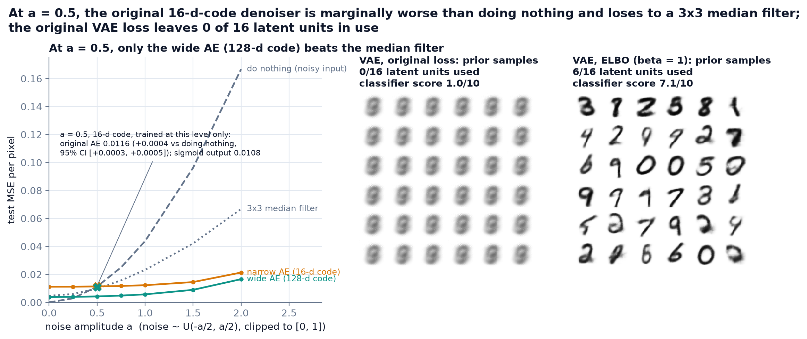
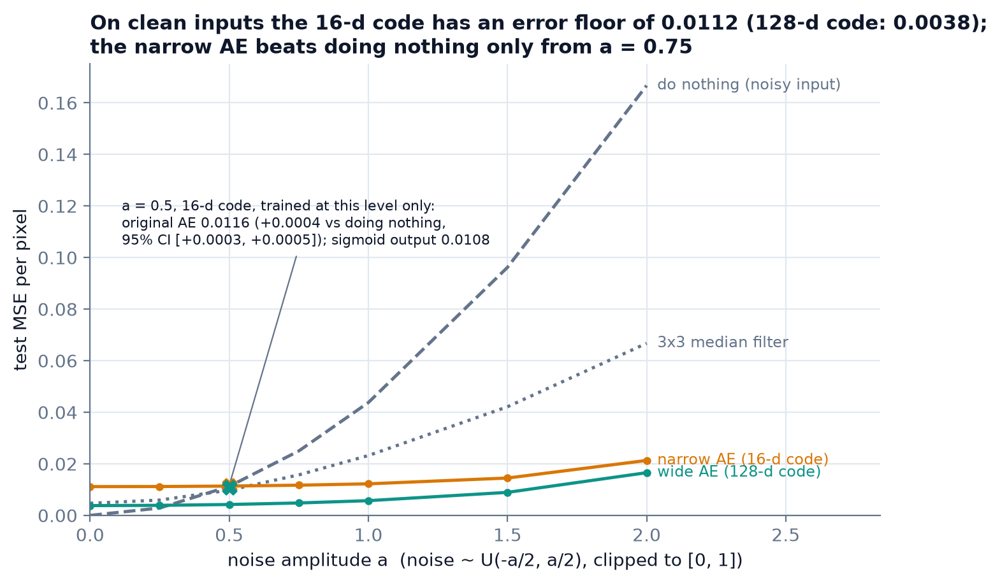
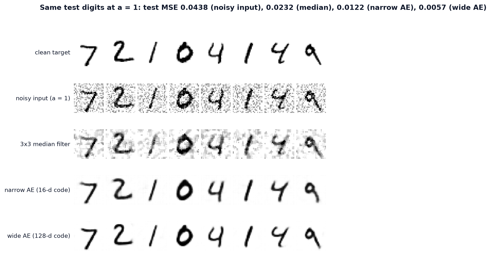
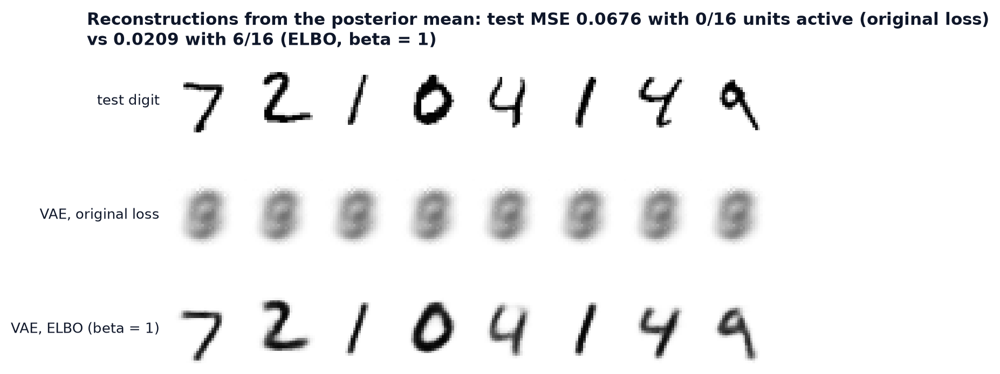
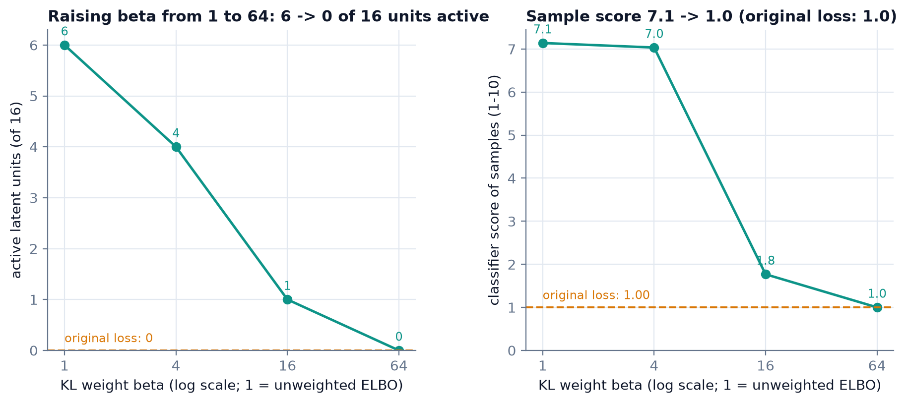
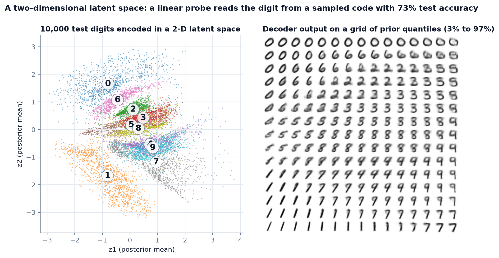

# mnist-latent-space-ae-vae

Do a denoising autoencoder and a VAE on MNIST beat trivial baselines? Measured on the test set: a 16-d-code AE loses to a 3×3 median filter, and a mis-scaled VAE loss leaves 0 of 16 latent units in use.

[](https://github.com/Pchambet/mnist-latent-space-ae-vae/actions/workflows/ci.yml)

[](LICENSE)
[](https://pchambet.github.io/mnist-latent-space-ae-vae/)



## TL;DR

- **The original denoiser loses to trivial baselines.** At the earlier noise level (a = 0.5) its test MSE is 0.0116: marginally worse than returning the noisy input (0.0113; difference +0.0004, 95% CI [+0.0003, +0.0005]) and worse than a 3×3 median filter (0.0098).
- **Its output head is a real but small bug.** Replacing the BatchNorm output by a sigmoid lowers the error by 7% (0.0108), still behind the median filter. Every AE with the original 16-d code has an error floor of 0.0107 to 0.0116 even on clean inputs.
- **The bottleneck is the limit.** A wider network with a 128-d code scores 0.0042 at a = 0.5, 2.3× lower than the median filter, and beats the median filter at every noise level tested.
- **The original VAE loss collapses the posterior.** It leaves 0 of 16 latent units active (KL 0.00 nats per image, a linear probe at chance, 10.5%) and every prior sample is the same blur (classifier score 1.00 out of 10). The Bernoulli ELBO keeps 6 of 16 units (KL 13.1 nats), the probe reaches 88.5% and the sample score 7.14 (real test digits: 9.60).
- **Raising the KL weight reproduces the collapse on purpose:** 6, 4, 1 and 0 active units at β = 1, 4, 16 and 64.

## Why it matters

A reconstruction that "looks clean" and samples that "look like digits" are not evidence that a model works. The decision a model check informs is simple: ship the model, or ship the baseline. Here the baselines are free (return the noisy input, or apply a 3×3 median filter) and the latent-space check is one variance per unit. Without them, an earlier implementation of these two models shipped a denoiser and a generative model that were each failing in a way its own figures could not show.

## Approach

1. **Data.** MNIST (official 60k/10k split). The last 10k images of a seeded shuffle of the training set are held out to select checkpoints; the test set is never used for selection.
2. **Noise.** Additive U(−a/2, a/2) noise, clipped to [0, 1], drawn once per image with a fixed seed so that every model and baseline sees the same corrupted test images.
3. **Baselines.** The noisy input itself ("do nothing") and a 3×3 median filter.
4. **Denoising models.** The original 5-layer convolutional AE with its original output head (ConvTranspose → BatchNorm → LeakyReLU on the output image), the same network with a sigmoid head, and two "blind" denoisers trained on fresh noise of random amplitude up to 2: the narrow original network (16-d code) and a wider 4-layer network (128-d code).
5. **VAEs.** The original loss (pixel-mean MSE + summed KL), the Bernoulli ELBO with β ∈ {1, 4, 16, 64}, and a 2-D latent model for visualisation.
6. **Diagnostics.** Test MSE with a paired bootstrap interval against doing nothing; active latent units (Var over inputs of the posterior mean > 0.01, Burda et al. 2016); a linear probe from a sampled code to the digit label; ELBO and a 64-sample importance-weighted bound; a classifier score of 10,000 samples from the prior, judged by a small CNN.

### Two failures, two different causes

- **Denoiser: the 16-d code, not the output head.** Every decoder block, the last one included, applied BatchNorm and LeakyReLU, so the output image was normalised per batch and unbounded. Replacing that head by a bare transposed convolution and a sigmoid is a real fix, but a small one: at a = 0.5 it lowers the test MSE by 7%, from 0.0116 to 0.0108, still behind a 3×3 median filter (0.0098). The limit is the 1×1×16 bottleneck: on clean inputs every AE with this code has an error floor of 0.0107 to 0.0116 MSE. Only a different, wider network with a 128-d code removes it.
- **VAE loss scale.** `F.mse_loss(x_hat, x)` averages over the 784 pixels, while the KL term is summed over latent units. Per image, the KL term is weighted 784× relative to the squared error (equivalently, a Gaussian decoder with a tiny fixed variance). The fix is the ELBO with both terms summed per image. Rather than rely on an "effective β", the pipeline measures the consequence: the number of latent units the model still uses.

A third bug in the earlier training loop, `best_state = model.state_dict()`, kept a live reference to the weights, so the "best" checkpoint was always the last epoch. It is fixed by a deep copy (tested in `tests/test_train.py`).

### What is and is not the earlier protocol

The models labelled "original" reproduce the earlier implementation's **architecture, output head, noise model and loss**. They are retrained under this repository's protocol, which differs from it:

| | Earlier implementation (course exercise) | This repository |
|---|--:|--:|
| Training images | 10,000 | 50,000 |
| Validation images | 10,000 | 10,000 (held out from train) |
| Batch size | 512 | 128 |
| Epochs | 20 | 10 |
| Checkpoint | last epoch (copy bug) | best validation epoch |

The earlier code is preserved in git history (commit `4386756`).

## Results

### Denoising at the earlier noise level (a = 0.5), test set

<!-- BEGIN:ae-table -->
| Method | Code dim | Params | Test MSE | PSNR (dB) | MSE minus do-nothing [95% CI] |
|---|--:|--:|--:|--:|--:|
| do nothing (noisy input) | - | - | 0.0113 | 19.5 | reference |
| 3x3 median filter | - | - | 0.0098 | 20.2 | -0.0015 [-0.0015, -0.0014] |
| original AE (BatchNorm output, retrained) | 16 | 93,363 | 0.0116 | 19.9 | +0.0004 [+0.0003, +0.0005] |
| original AE, sigmoid output | 16 | 93,361 | 0.0108 | 20.3 | -0.0005 [-0.0006, -0.0004] |
| narrow AE (16-d code) | 16 | 93,361 | 0.0114 | 20.1 | +0.0001 [+0.0000, +0.0002] |
| wide AE (128-d code) | 128 | 260,065 | 0.0042 | 24.2 | -0.0070 [-0.0071, -0.0070] |
<!-- END:ae-table -->

Only the wide AE beats the median filter. The sigmoid head moves the original network from marginally worse than doing nothing to marginally better, a 7% gain. The narrow blind AE, trained on random noise levels, is marginally worse than doing nothing here (its 95% interval only just excludes zero).

### Test MSE across noise levels

<!-- BEGIN:ae-curve -->
| Method | a = 0 | a = 0.25 | a = 0.5 | a = 0.75 | a = 1 | a = 1.5 | a = 2 |
|---|--:|--:|--:|--:|--:|--:|--:|
| do nothing (noisy input) | 0.0000 | 0.0029 | 0.0113 | 0.0250 | 0.0438 | 0.0962 | 0.1667 |
| 3x3 median filter | 0.0047 | 0.0059 | 0.0098 | 0.0157 | 0.0232 | 0.0421 | 0.0667 |
| original AE (BatchNorm output, retrained) | 0.0116 | 0.0115 | 0.0116 | 0.0129 | 0.0186 | 0.0497 | 0.0757 |
| original AE, sigmoid output | 0.0107 | 0.0107 | 0.0108 | 0.0117 | 0.0168 | 0.0518 | 0.0838 |
| narrow AE (16-d code) | 0.0112 | 0.0112 | 0.0114 | 0.0117 | 0.0122 | 0.0145 | 0.0213 |
| wide AE (128-d code) | 0.0038 | 0.0039 | 0.0042 | 0.0048 | 0.0057 | 0.0089 | 0.0166 |
<!-- END:ae-curve -->



The three 16-d-code AEs sit on a floor of about 0.011 whatever the noise: up to a = 0.5 they lose to the median filter, and up to a = 0.25 to doing nothing (at a = 0.5, two of the three still do). The two models trained at a = 0.5 only fall behind the median filter again from a = 1.5. The wide AE has a floor of 0.0038, beats the median filter at every amplitude and beats doing nothing from a = 0.5; the narrow blind AE needs a = 0.75.



### VAEs, test set

<!-- BEGIN:vae-table -->
| Objective | Active units | KL (nats) | -ELBO (nats)* | -IWAE64 (nats)* | Recon. MSE | Probe acc. | Sample score |
|---|--:|--:|--:|--:|--:|--:|--:|
| original loss (pixel-mean MSE + KL) | 0/16 | 0.00 | n/a | n/a | 0.0676 | 10.5% | 1.00 |
| Bernoulli ELBO, beta = 1 | 6/16 | 13.07 | 114.6 | 110.8 | 0.0209 | 88.5% | 7.14 |
| Bernoulli ELBO, beta = 4 | 4/16 | 6.28 | 133.2 | 126.2 | 0.0300 | 78.7% | 7.04 |
| Bernoulli ELBO, beta = 16 | 1/16 | 0.62 | 192.1 | 183.8 | 0.0588 | 26.9% | 1.77 |
| Bernoulli ELBO, beta = 64 | 0/16 | 0.00 | 205.8 | 205.8 | 0.0675 | 10.5% | 1.00 |
| Bernoulli ELBO, beta = 1, 2-D latent | 2/2 | 6.05 | 146.8 | 143.8 | 0.0390 | 73.0% | 6.56 |
<!-- END:vae-table -->

\* Bernoulli cross-entropy bounds on grey-level (not binarised) pixels, in nats per image: comparable between rows of this table only, not with the ~80–90 nats usually reported on binarised MNIST. "n/a" for the original loss, which has no Bernoulli decoder. Sample score: exp E[KL(p(y|x) ‖ p(y))] from the judge CNN on 10,000 samples from the prior, from 1 (every sample looks alike) to 10.

Under the original loss the posterior equals the prior for every input: no active unit, a probe at chance, and the same average digit as the reconstruction of every test image (MSE 0.0676). The ELBO at β = 1 carries 13.1 nats per image through 6 of its 16 units and reconstructs at MSE 0.0209. The 10 unused units are the usual VAE behaviour (Burda et al. 2016), not a bug.





Raising β drives the ELBO model into the same collapse: at β = 64 it matches the original loss on every diagnostic (0/16 units, probe 10.5%, sample score 1.00). That is what a KL term weighted far too heavily does, and the original loss scale weights it 784 times too much.



## Reproduce

```bash
make setup   # uv sync --locked (Python 3.12)
make data    # download MNIST into data/raw (about 65 MB, cached)
make run     # train 11 models (checkpoints cached in data/interim), evaluate, draw docs/figures
make report  # build site/index.html and refresh the tables in this README
```

Measured on an Apple M4 (MPS, `--threads 3`): training the 10 models takes about 31 minutes in total (per-model times in `results/history.json`), plus a short judge CNN and about a minute of evaluation. Checkpoints are cached in `data/interim` (8 MB), so a rerun only evaluates; MNIST takes 63 MB in `data/raw`. Pass `--device cpu|mps|cuda`, `--threads N` or `--retrain` with `uv run mnist-latent run`. `make test` and `make lint` run the checks that CI runs.

## Repository layout

```
src/mnist_latent/
  data.py         MNIST download, held-out validation split, seeded noise
  models.py       convolutional AE and VAE, original and corrected output heads
  losses.py       KL, Bernoulli ELBO, original loss, importance-weighted bound
  train.py        training loops with best-checkpoint selection on validation
  metrics.py      baselines, bootstrap CI, active units, probe, sample score
  experiments.py  the full study: every model, cached, evaluated on the same test images
  figures.py      static figures (docs/figures)
  report.py       site/index.html and the README tables, from results/metrics.json
tests/            unit tests, and training tests on synthetic data with a known answer
results/          metrics.json and history.json written by `make run`
docs/figures/     PNG figures used here
site/index.html   the self-contained report
```

## Methodology notes and limitations

- **One training seed, on MPS.** The confidence intervals cover test-set sampling only, not training randomness. MPS is not bit-for-bit deterministic, so CPU or CUDA reruns match up to small numerical differences.
- **10 epochs, no tuning.** Most models reached their best validation loss in epoch 9 or 10, so longer training would likely lower every model's error. Only the wide AE and the median filter are far from the do-nothing baseline at a = 0.5; the small margins of the 16-d models could change with more training.
- **The bottleneck claim is not a clean ablation.** The narrow and wide AEs differ in depth, width and parameter count (93k vs 260k) as well as code size. The evidence that the 16-d code is the limit is the error floor of about 0.011 on clean inputs, shared by all three 16-d models whatever their head or training noise.
- **The "original" models are retrained under this protocol**, not the earlier one (10k images, 20 epochs, last-epoch weights); only their architecture, output head, noise and loss are reproduced.
- **The sample score depends on a 3-epoch judge CNN** (98.75% test accuracy). It ranks the models here and is not comparable with scores published elsewhere.
- **ELBO and IWAE values use a Bernoulli likelihood on grey-level pixels** (see the note under the VAE table).

## References

- D. P. Kingma, M. Welling. *Auto-Encoding Variational Bayes.* ICLR 2014.
- Y. Burda, R. Grosse, R. Salakhutdinov. *Importance Weighted Autoencoders.* ICLR 2016 (IWAE bound, active units).
- I. Higgins et al. *β-VAE: Learning Basic Visual Concepts with a Constrained Variational Framework.* ICLR 2017.
- P. Vincent et al. *Extracting and Composing Robust Features with Denoising Autoencoders.* ICML 2008.
- T. Salimans et al. *Improved Techniques for Training GANs.* NeurIPS 2016 (Inception score, adapted here with an MNIST classifier).
- Y. LeCun, C. Cortes, C. J. C. Burges. *The MNIST database of handwritten digits.* Downloaded through torchvision mirrors.

---

Built by [Pierre Chambet](https://github.com/Pchambet) — decision science for operations under uncertainty.
